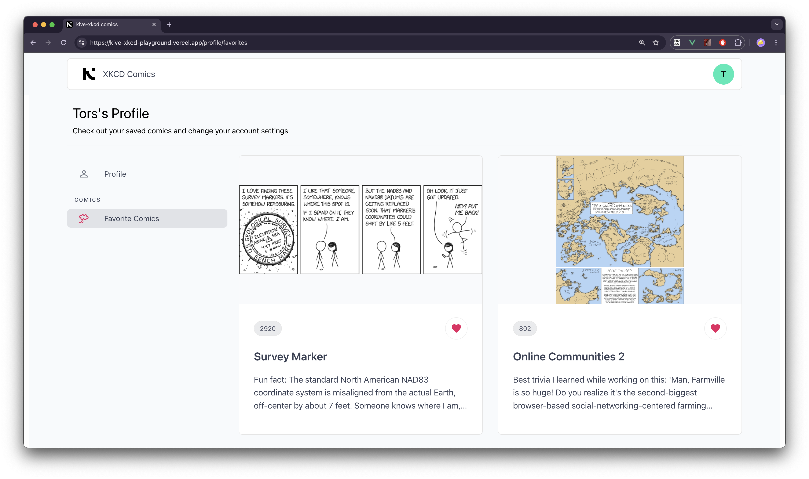
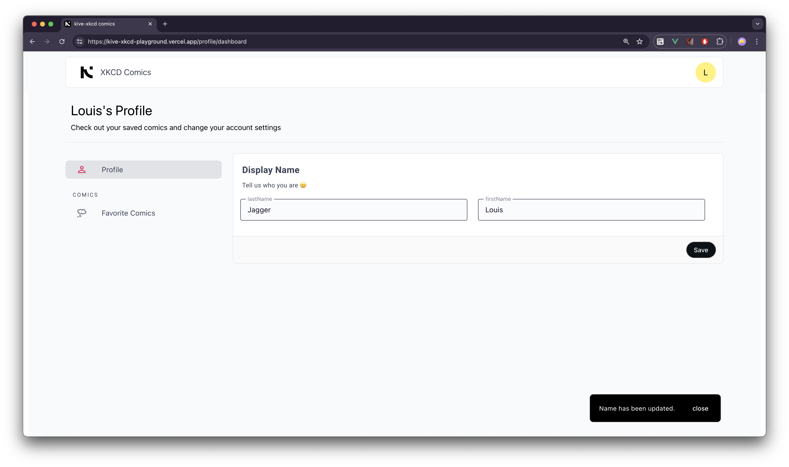

<p align="start">
  <a href="#" target="_blank" rel="noopener noreferrer">
    
  </a>
</p>

# <span style="color: #fff;"> XKCD APIs Playground Vue3 / Vite / Vercel / Firebase </span>

## Features ✨

- Browse all the available comics wth navigation buttons
- Drill-down comic info for details about image download and metadata
- Save your favorite comics to your account
- Comic IDs synced up with url params
- Authentication powered by google firebase
- Quick authentication with google authentication provider
- Scalable architecture based on component reusability
- State management with Pinia
- Proxy server configured in vite for development and in Vercel serveless in a production build.

   
   

## 🚀 CLI commands

```bash

# clone
git clone https://github.com/santiagoaloi/kive-xkcd-playground.git

# enter the project directory
cd kive-xkcd-playground

# install dependencies
pnpm i

# start the dev web server
pnpm dev

# Build and preview on local enviroment
pnpm build-preview

```

## Linting and formatting

[](https://github.com/antfu/eslint-config)
